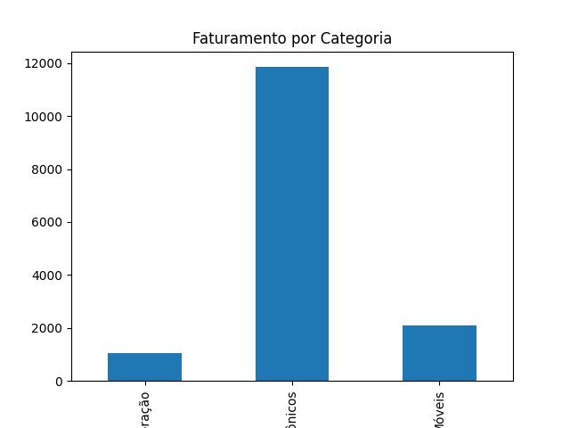

# 📊 Análise de Dados de Vendas

## 🎯 Objetivo
Analisar dados de vendas para identificar padrões e gerar insights estratégicos.

## 🛠️ Tecnologias
- Python
- Pandas
- Matplotlib

## 📈 Análises realizadas
- Faturamento total
- Produtos mais vendidos
- Faturamento por categoria

## 📊 Principais Insights
- O faturamento total foi de R$ 15.000
- O produto mais vendido foi o Mouse
- A categoria com maior faturamento foi Eletrônicos

## 📈 Visualização


## 🚀 Como executar
```bash
pip install pandas matplotlib
python analise.py

## 🚀 Como executar

1. Clone o repositório:
```bash
git clone https://github.com/ldferreirads/analise-dados-vendas.git

#Acesse a pasta do projeto
cd analise-dados-vendas

#Instale as dependências
pip install pandas matplotlib

#Execute o script
python analise.py

## 📦 Requisitos
- Python 3.x
